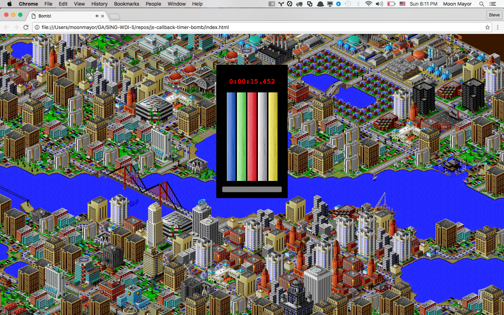
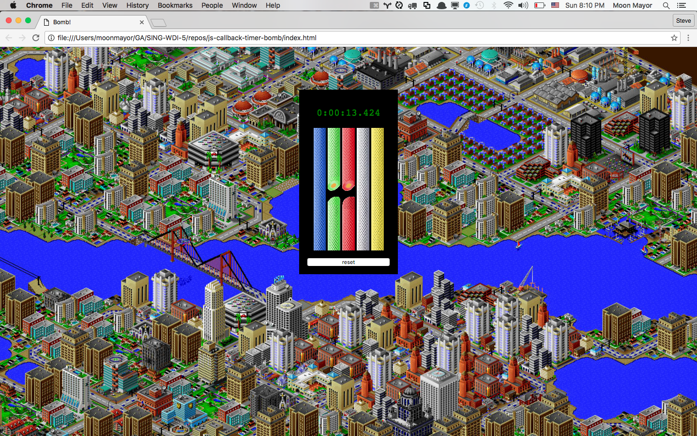
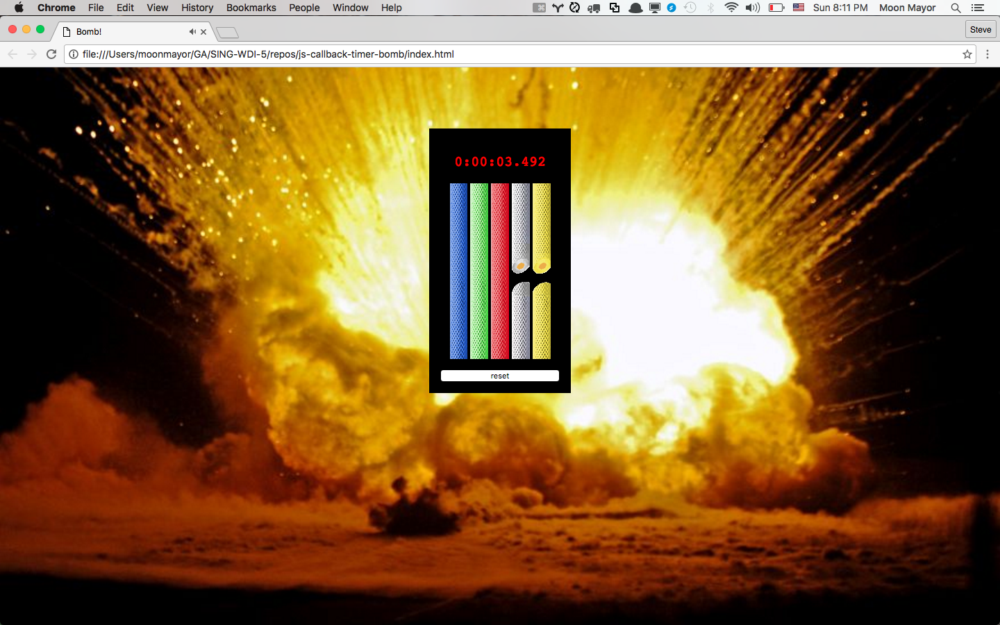

# JavaScript Timers: Sim City Bomb Squad

Someone left a bomb in the middle of Sim City. It's your first day on the
bomb squad and it's your job to defuse it. The entire city is relying on
you!

## The Basics






## Implementation Details

### Choosing Wires

### Maintaining State

## Requirements
- Maintain proper indentation through HTML, CSS and JavaScript files.
- Use functions to reduce redundancy. For example, our solution code has 40
  lines of CSS, about 170 lines of JavaScript, and about ten functions.
- Use at least one array `forEach` function to iterate through a list.
- Keep the number of global variables to a minimum. The solution code
  uses five global variables.

```js
var list = [1, 2, 3];
list.foreach(function(element) {
  console.log(element);
});
```

### Bonus: Add Sounds
The website will really come alive after adding sound. There's a collection of
original Sim City 2000 sounds included in this repo in the `sounds` directory.

Add the following effects:
- play the electricity sound effect whenever a wire is cut.
- loop the siren while the bomb is being defused.
- play the building explosion effect if the bomb explodes.
- play the cheering noise if the bomb is defused.
- play the success song after the cheering finishes playing.

### Bonus: <audio> Specification
HTML5 added an `<audio>` tag that makes it easy to add sound to a website.

MDN and W3Schools have good documentation about the audio tag. Go to W3Schools
for a basic introduction, and go to MDN if you want to really dig into details
of the specification.

<http://www.w3schools.com/tags/tag_audio.asp>
<https://developer.mozilla.org/en/docs/Web/HTML/Element/audio>

Here's some simple examples of how to interact with audio elements.

```html
<!-- an audio tag with the "controls" attribute will appear on the page. -->
<audio controls src="song.mp3"></audio>

<!--
  An audio tag without "controls" will be invisible.
  Adding the "autoplay" attribute will make the audio start automatically.
  Adding the "loop" attribute will make the audio play forever.
-->
<audio id="background" autoplay loop src="background-music.mp3"></audio>

<audio id="laughter" src="laughter.wav"></audio>
<audio id="cheers" src="cheers.wav"></audio>
<audio id="boo" src="boo.wav"></audio>
```

Select an audio tag as you would any other HTML element.

```js
// trigger audio by calling the play function.
var soundEffect = document.getElementById("laughter");
soundEffect.play();

// "stop" the audio by pausing it and resetting currentTime to zero.
var background = document.getElementById("background");
background.pause();
background.currentTime = 0;
```

You can have one sound play after another by adding an event listener to
an audio element and waiting for it to broadcast it's `"ended"` event:

```js
var first = document.getElementById("laughter");
first.addEventListener("ended", function() {
  var second = document.getElementById("cheers");
  second.play();
});

first.play();
```

Here's some notes from the MDN website explaining these common attributes:

```
autoplay
A Boolean attribute; if specified (even if the value is "false"!), the audio
will automatically begin playback as soon as it can do so, without waiting for
the entire audio file to finish downloading.

controls
If this attribute is present, the browser will offer controls to allow
the user to control audio playback, including volume, seeking, and pause/resume
playback.

loop
A Boolean attribute; if specified, will automatically seek back to the
start upon reaching the end of the audio.
```

## Licensing
All content is licensed under a CC­BY­NC­SA 4.0 license.
All software code is licensed under GNU GPLv3. For commercial use or alternative licensing, please contact legal@ga.co.

